# Guide utilisateur Lapwiz Setup (complet + images)

Ce guide explique **dans quel ordre** utiliser Lapwiz après une infection (souvent **Win64/Expiro**), et le rôle de chaque onglet.

> **Principe :** nettoyer **avant** de réinstaller des `.exe`. Sur un PC encore infecté, winget peut réinstaller des programmes qui se font réinfecter.

---

## Sommaire

1. [Qu’est-ce que Lapwiz ?](#1-quest-ce-que-lapwiz-)
2. [Lancer l’application](#2-lancer-lapplication)
3. [Parcours Expiro (LiveDisk → Safe Mode → outils)](#3-parcours-expiro)
4. [KVRT (Kaspersky Virus Removal Tool)](#4-kvrt)
5. [Scripts automatiques](#5-scripts-automatiques)
6. [ADB / scrcpy Repair](#6-adb--scrcpy-repair)
7. [Store / Installateur (winget)](#7-store--installateur)
8. [SynapticRemover](#8-synapticremover)
9. [Chemins et fichiers utiles](#9-chemins-et-fichiers-utiles)
10. [Checklist finale](#10-checklist-finale)

---

## 1. Qu’est-ce que Lapwiz ?

Lapwiz Setup est une appli **PowerShell + interface graphique** (pas d’`.exe` custom Lapwiz) qui regroupe :

| Onglet | Rôle |
|---|---|
| **Store** | Catalogue d’apps winget (réinstaller proprement) |
| **ADB Repair** | Remplacer `adb` / `scrcpy` altérés (packs clean) |
| **Installateur** | msiexec, PATH ADB, installation forcée |
| **Guide Expiro** | Wizard illustré anti-Expiro |
| **Scripts** | Audit Trend, Startup, services AV, KVRT, MBAM, Defender |
| **KVRT** | Guide + captures Kaspersky |
| **SynapticRemover** | Nettoyage Synaptics (console Admin) |

Sources Expiro : [WinTips](https://www.wintips.org/remove-win32-expiro-virus/), [Trend Micro EXPIRO.AA](https://www.trendmicro.com/vinfo/us/threat-encyclopedia/malware/virus.win64.expiro.aa).


---

## 2. Lancer l’application

1. Télécharger la [release GitHub](https://github.com/LapwizTeam/Lapwiz-Team-ExeBackup/releases/latest) **ou** utiliser le dossier `LapwizSetup/`
2. Double-clic **`Lancer-LapwizSetup.cmd`**
3. Accepter l’**UAC** (droits admin)
4. Au démarrage d’une **release** : vérification automatique `RELEASE-SHA256.txt`

Prérequis : Windows 10/11, PowerShell 5.1+, [winget](https://aka.ms/getwinget).

---

## 3. Parcours Expiro

Ordre typique (onglet **Guide Expiro** dans Lapwiz) :

### Étape A — LiveDisk sur un PC sain

Préparer **Dr.Web LiveDisk** (ISO) sur un PC **non infecté**, graver / USB bootable.

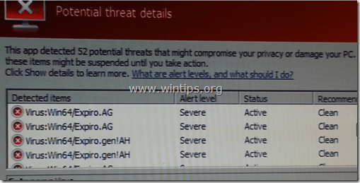

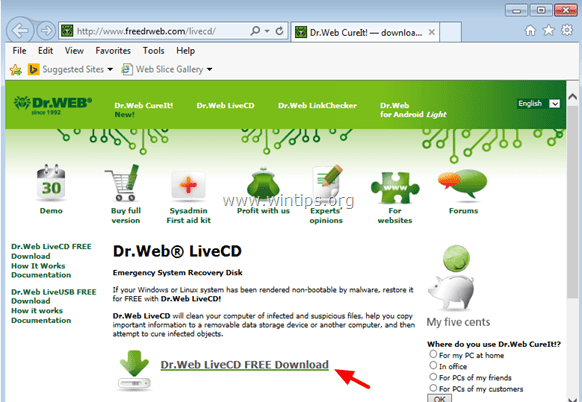


### Étape B — Boot + scan hors Windows

1. Boot USB/DVD (BIOS/UEFI)
2. Choisir la langue
3. Scanner → **Full Scan** → lancer
4. **Cure** des `.exe` infectés
5. Éteindre proprement, retirer le média

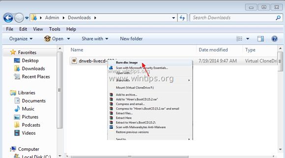

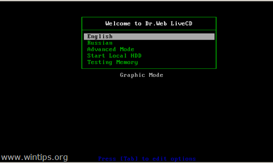

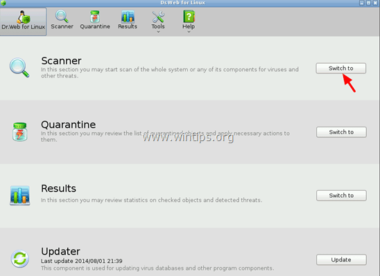

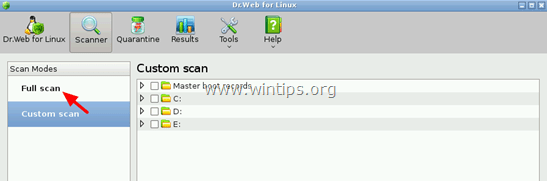

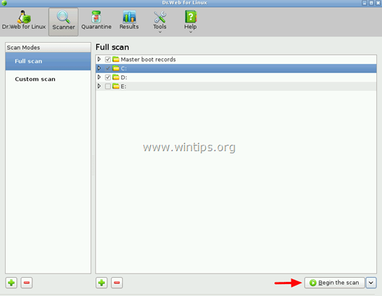

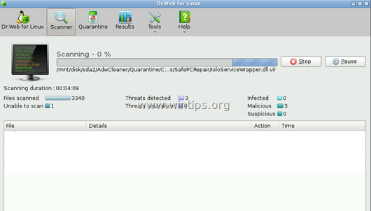

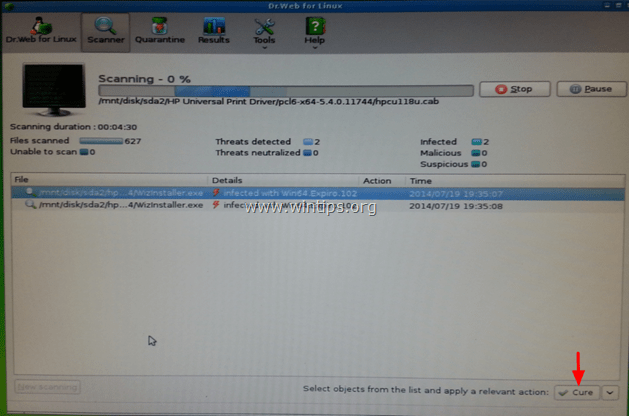

### Étape C — Mode sans échec + réseau

Windows 10/11 : récupération / démarrage avancé, **ou** `msconfig` → Démarrage sécurisé + Réseau.

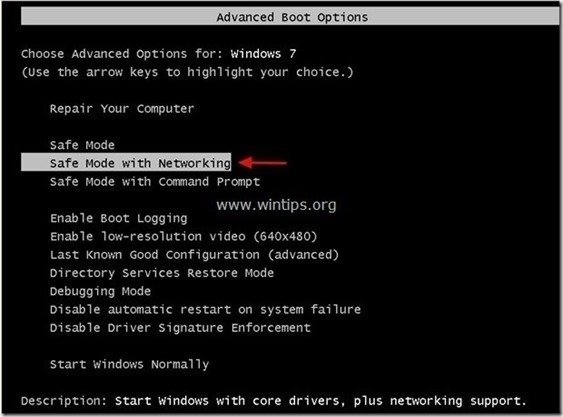

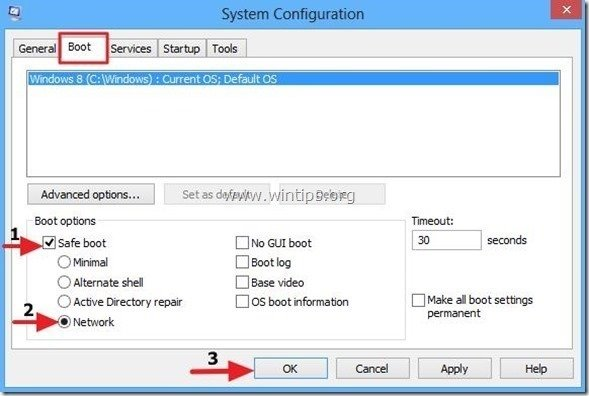


Dans Lapwiz (**Scripts**) : Audit Trend → Corriger Startup → Relancer services AV.

### Étape D — RogueKiller → AdwCleaner → Malwarebytes

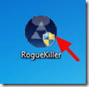

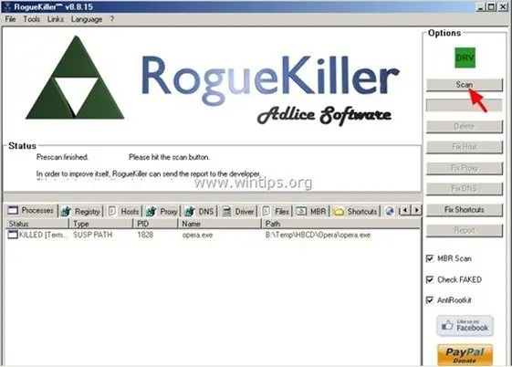

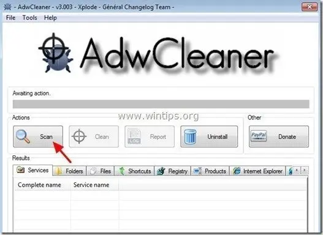

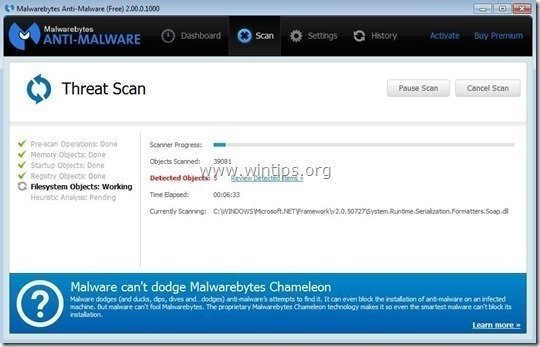


### Étape E — Defender + réinstaller les apps

Scan Defender complet (tous disques + USB). Si plus d’Expiro → onglet **Store / Installateur**.


> Ne restaure **jamais** d’anciens `.exe` / Program Files infectés. Sauvegarde docs/photos seulement.

Texte détaillé : [`LapwizSetup/Guides/Expiro-WinTips.txt`](../LapwizSetup/Guides/Expiro-WinTips.txt).

---

## 4. KVRT

Outil one-shot Kaspersky (pas de protection temps réel). Howto officiel : [support.kaspersky.com](https://support.kaspersky.com/kvrt2020/howto/15674).


### Déroulé illustré

1. **Change parameters**

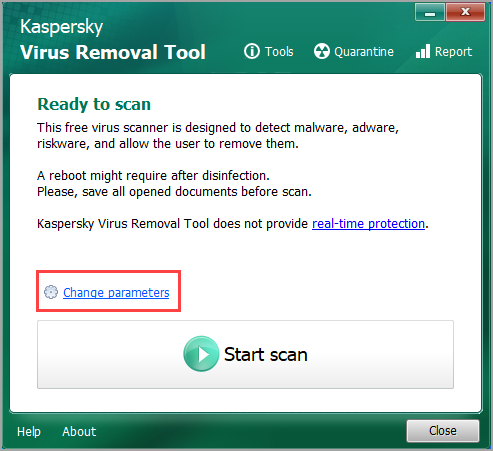

2. **Scan settings / Add object / OK**

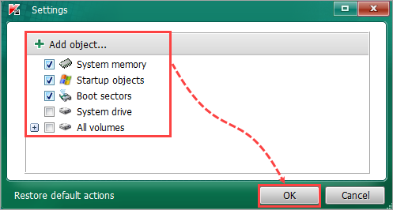

3. **Start scan**

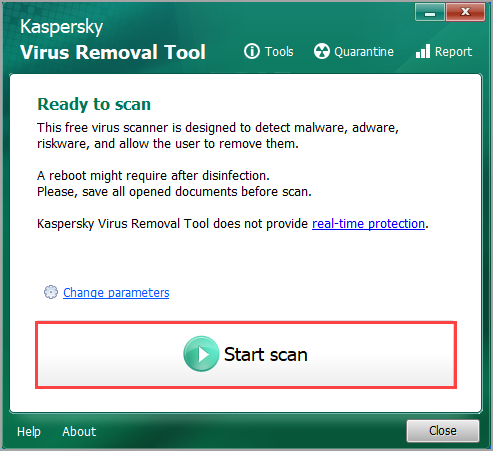

4. **Détails / rapport**

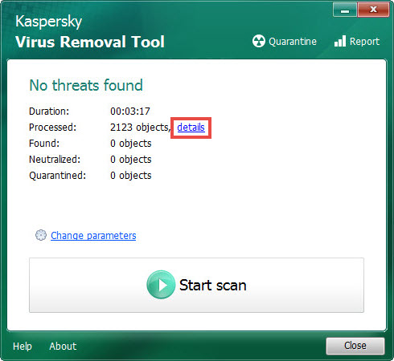

5. **Close** puis Defender / AV temps réel

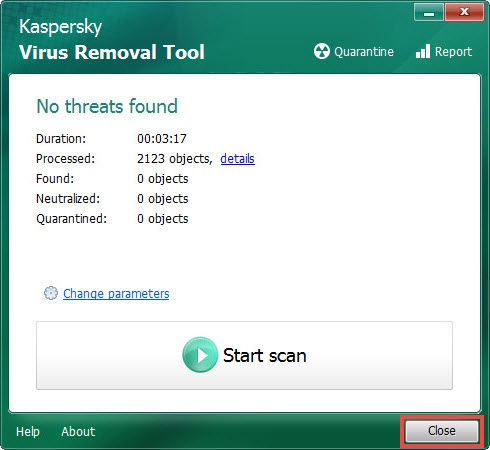

Captures complémentaires Lapwiz :


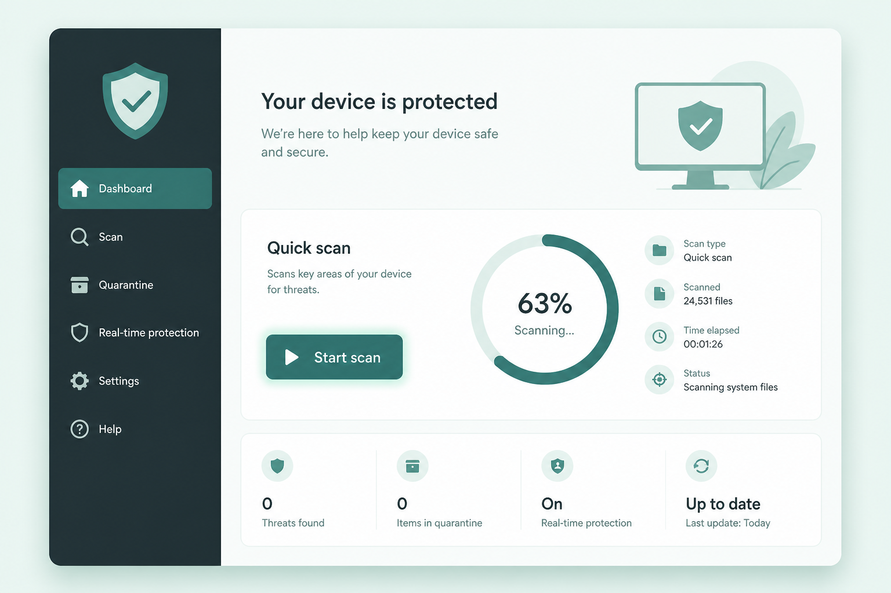

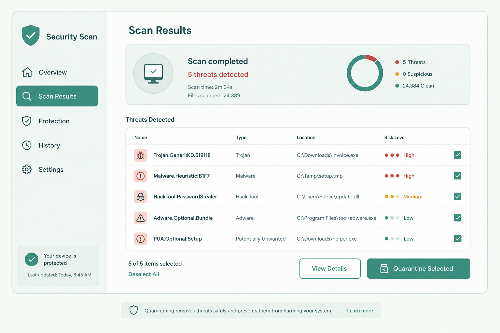

Dans Lapwiz : onglet **Scripts** ou **KVRT** → Télécharger / Lancer KVRT (`%LocalAppData%\Lapwiz\tools\KVRT.exe`).

Texte : [`LapwizSetup/Guides/Kvrt-Guide.txt`](../LapwizSetup/Guides/Kvrt-Guide.txt).

---

## 5. Scripts automatiques

Onglet **Scripts** (souvent en Safe Mode) :

| Action | Rôle |
|---|---|
| Audit Trend | Indices Expiro / Startup / services |
| Corriger Startup | Remet les dossiers Démarrage Windows |
| Relancer services AV | Defender / WSC / etc. |
| Supprimer artefacts | Fichiers suspects LocalAppData / ProgramData |
| KVRT / MBAM / Defender | Lancer les outils |

Le **journal** détaillé est à droite de la fenêtre Lapwiz.

---

## 6. ADB / scrcpy Repair

Après Expiro, `adb.exe`, `AdbWin*.dll` et `scrcpy` sont souvent corrompus. L’onglet **ADB Repair** les remplace par des packs **propres**.

Dans l’app : bouton **i** (guide intégré A→Z).

### Ordre recommandé

```text
1. Packs clean     → Apprendre (Bureau) ou Télécharger
2. Scanner         → dossier / rapide / disque
3. Cocher          → Tout cocher / Tout décocher
4. Tout réparer    → rapport détaillé automatique
5. Optionnel       → PATH ADB Lapwiz + quarantaine
```

### Packs de référence (Bureau)

Placez sur le Bureau avant réparation :

- `platform-tools` (Google)
- `scrcpy-win64-v4.1` (Genymobile)

Lapwiz les copie vers :

`%LocalAppData%\LapwizSetup\clean-tools\`

### Ce que fait « Tout réparer »

1. Recharge les packs Bureau si présents  
2. **Dossier scrcpy** → sync pack scrcpy + trio **ADB Google**  
3. **Dossier platform-tools** → sync **pack Google complet**  
4. Flux : **backup quarantaine → suppression → copie clean** + SHA-256  
5. Fichiers **hors pack** (DB Coolray, APK, configs) : **intacts**  
6. Vérification d’incohérences + **rapport** à la fin  

Quarantaine : `%LocalAppData%\LapwizSetup\adb-quarantine\yyyyMMdd_HHmmss\` (+ `repair-report.txt`).

> L’`adb.exe` du ZIP scrcpy ≠ Google : Lapwiz **force Google** à côté de scrcpy.

Texte : [`LapwizSetup/Guides/Adb-Repair-Guide.txt`](../LapwizSetup/Guides/Adb-Repair-Guide.txt).

---

## 7. Store / Installateur

Quand le PC est **propre** :

1. Onglet **Store** → cocher les apps → installer (winget)
2. Ou **Installateur** → réparation msiexec si erreurs MSI (1601…), PATH ADB

### Ajouter une app perso

1. Nom ou ID winget (ex. `Anysphere.Cursor`)  
2. Rechercher → catégorie → Ajouter  
3. Persistance : `%LOCALAPPDATA%\LapwizSetup\packages.user.json`

Catalogue de base : [`LapwizSetup/packages.json`](../LapwizSetup/packages.json).

---

## 8. SynapticRemover

Onglet dédié : nettoyage Synaptics en **console Admin** séparée (`Nettoyage-Automatique.bat` / Interactif). Suivi aussi dans le journal Lapwiz.

---

## 9. Chemins et fichiers utiles

| Chemin | Rôle |
|---|---|
| `LapwizSetup\Lancer-LapwizSetup.cmd` | Lancement |
| `%LocalAppData%\LapwizSetup\clean-tools\` | Packs ADB/scrcpy appris |
| `%LocalAppData%\LapwizSetup\adb-quarantine\` | Backups avant repair |
| `%LocalAppData%\LapwizSetup\crash.log` | Crashes UI |
| `%LocalAppData%\Lapwiz\tools\KVRT.exe` | KVRT téléchargé |
| `RELEASE-SHA256.txt` | Intégrité package release |

---

## 10. Checklist finale

- [ ] LiveDisk / scans hors Windows si infection lourde  
- [ ] Safe Mode : Startup + services AV (Scripts)  
- [ ] RogueKiller / AdwCleaner / MBAM / KVRT  
- [ ] Defender (tous disques + USB)  
- [ ] **ADB Repair** si Coolray / scrcpy / platform-tools cassés  
- [ ] **Store** : réinstaller les apps (ne pas restaurer d’anciens EXE)  
- [ ] Vérifier que plus aucune détection Expiro  

---

## Liens

- Releases : https://github.com/LapwizTeam/Lapwiz-Team-ExeBackup/releases  
- Code source : https://github.com/LapwizTeam/Lapwiz-Team-ExeBackup  
- WinTips Expiro : https://www.wintips.org/remove-win32-expiro-virus/  
- Trend EXPIRO.AA : https://www.trendmicro.com/vinfo/us/threat-encyclopedia/malware/virus.win64.expiro.aa  
- KVRT howto : https://support.kaspersky.com/kvrt2020/howto/15674  
